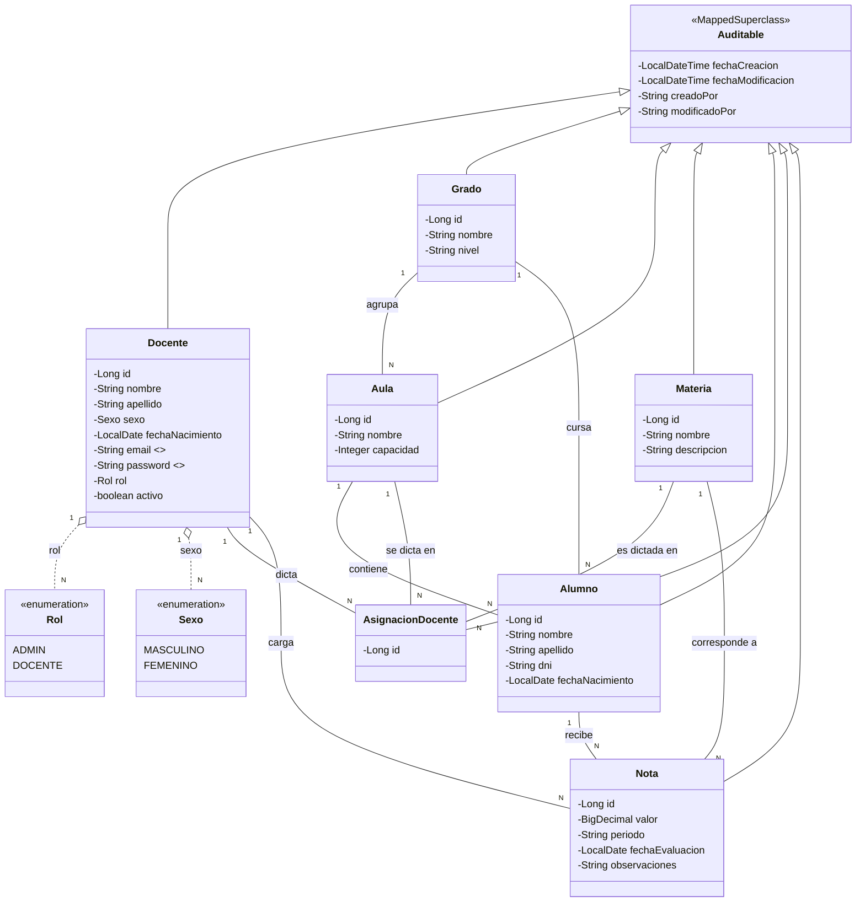

# Colegio Spark — Sistema de Gestión Escolar

Trabajo práctico de arquitectura **MVC** con **Thymeleaf**, **ORM (JPA/Hibernate)**
sobre **MySQL**, comunicación entre capas mediante **DTO**, **auditoría de
entidades** y **seguridad** (Spring Security) con login de docentes.

La interfaz visual reutiliza la plantilla Bootstrap 5 provista (*Spark Admin*),
adaptando el layout general (sidebar + topbar), las tablas y los formularios a
vistas Thymeleaf dinámicas. **El dashboard de gráficos de la plantilla original
se descartó a propósito**, tal como se pidió; en su lugar hay un panel simple
de bienvenida (`/panel`).

---

## 1. Cómo ejecutar el proyecto

### Requisitos
- JDK 17+
- Maven 3.9+ (o el wrapper `mvnw`, si lo agregás)
- MySQL 8.x corriendo en `localhost:3306` (o ajustar `application.properties`)

### Pasos
1. Crear la base de datos (opcional: `spring.datasource.url` ya incluye
   `createDatabaseIfNotExist=true`, así que MySQL la crea sola si el usuario
   tiene permisos):
   ```sql
   CREATE DATABASE IF NOT EXISTS colegio_spark_db;
   ```
2. Configurar credenciales por variables de entorno (recomendado) o editando
   directamente `src/main/resources/application.properties`:
   ```bash
   export DB_USERNAME=root
   export DB_PASSWORD=tu_password
   export MAIL_USERNAME=tu_correo@gmail.com
   export MAIL_PASSWORD=tu_contraseña_de_aplicacion
   ```
   > El envío de correo requiere una **contraseña de aplicación** de Gmail (u
   > otro proveedor SMTP). Si no se configura, el registro de un docente
   > igual se completa: el error de envío queda solamente registrado en el
   > log (ver `EmailServiceImpl` y la propiedad `app.mail.fallar-silenciosamente`).
3. Ejecutar:
   ```bash
   mvn spring-boot:run
   ```
4. Abrir `http://localhost:8080` (redirige a `/login`).

### Usuario administrador inicial
Al arrancar por primera vez, si no existe ningún docente con rol `ADMIN`, el
sistema crea uno automáticamente (ver `config/DataInitializer.java`):

```
email:    admin@colegiospark.edu.ar
password: Admin1234
```

Se recomienda cambiar esa contraseña desde **Mi perfil → Cambiar contraseña**
apenas se ingresa. Los demás docentes se dan de alta ellos mismos desde
`/registro` (quedan con rol `DOCENTE`).

---

## 2. Arquitectura MVC — capas del proyecto

```
com.colegio.spark
├── SparkColegioApplication.java     Arranque de la aplicación (Spring Boot)
│
├── model/                            (M) CAPA MODEL — Entidades JPA / ORM
│   ├── base/Auditable.java             clase base con auditoría (@MappedSuperclass)
│   ├── enums/ (Sexo, Rol)
│   └── Docente, Alumno, Grado, Aula, Materia, AsignacionDocente, Nota
│
├── repository/                       Acceso a datos (Spring Data JPA)
│   └── un JpaRepository<Entidad, Long> por cada entidad
│
├── dto/                               DATA TRANSFER OBJECTS
│   ├── request/   DTO de entrada (con Bean Validation)
│   └── response/  DTO de salida (nunca exponen password ni relaciones LAZY crudas)
│
├── mapper/                           Conversión Entidad <-> DTO (capa dedicada)
│
├── service/                          LÓGICA DE NEGOCIO (interfaces)
│   └── impl/                         Implementaciones (@Service, @Transactional)
│
├── controller/                       (C) CAPA CONTROLLER — Spring MVC
│   └── @Controller (no @RestController): devuelven nombres de vistas Thymeleaf
│
├── config/                           Configuración transversal
│   ├── SecurityConfig.java             autenticación/autorización
│   ├── JpaAuditingConfig.java           habilita auditoría JPA
│   ├── AuditorAwareImpl.java             "quién" está haciendo el cambio
│   ├── AsyncConfig.java                  habilita @Async (envío de mail)
│   └── DataInitializer.java              crea el ADMIN inicial
│
└── exception/                        Excepciones de negocio + @ControllerAdvice

src/main/resources/
├── templates/                        (V) CAPA VIEW — Thymeleaf
│   ├── fragments/layout.html           sidebar/topbar reutilizables
│   ├── auth/ (login, registro)
│   ├── panel.html
│   ├── perfil/, docentes/, alumnos/, grados/, aulas/, materias/,
│   │   asignaciones/, notas/, error/
└── static/assets/                    CSS/JS/imágenes de la plantilla Spark Admin
```

**Flujo típico de una petición (ejemplo: alta de un Alumno):**

`Browser` → `AlumnoController` (recibe `AlumnoDTO`, valida con `@Valid`) →
`AlumnoService` (regla de negocio: DNI único, resuelve Grado/Aula) →
`AlumnoRepository` (INSERT vía Hibernate/JPA) → la entidad `Alumno` persistida
se traduce con `AlumnoMapper` a `AlumnoResponseDTO` → el `Controller` decide la
vista (`redirect:/alumnos`) → Thymeleaf renderiza el listado.

En ningún punto la entidad JPA `Alumno` viaja hacia la vista: siempre se
comunica a través de DTO, que es justamente lo pedido en la consigna.

---

## 3. Modelo de datos — Diagrama de clases (rediseñado)



### Justificación de las entidades agregadas para el login de docentes

- **`Docente`** ahora concentra tanto los datos personales pedidos
  (`nombre`, `apellido`, `sexo`, `fechaNacimiento`) como las credenciales de
  acceso: `email` (usuario) y `password` (hash BCrypt). Se decidió **no**
  crear una entidad `Usuario` separada de `Docente` porque, en este dominio,
  todo usuario del sistema **es** un docente (no hay otro tipo de cuenta más
  que el `rol` `ADMIN`/`DOCENTE`, ambos son igualmente `Docente`).
- **`Rol`** (enum) resuelve la autorización: `ADMIN` administra la estructura
  académica; `DOCENTE` carga notas en lo que tiene asignado.
- **`AsignacionDocente`** es la entidad clave que faltaba para que un login
  tenga sentido de negocio: sin ella, cualquier docente logueado podría
  cargar notas de cualquier materia/aula. Con ella, `NotaService` valida a
  nivel de datos que el docente autenticado tenga esa combinación
  materia+aula asignada antes de guardar la nota.

---

## 4. Seguridad

- **Autenticación**: formulario propio (`/login`) procesado por Spring
  Security (`SecurityConfig`), usando el **email** como username y
  `CustomUserDetailsService` para resolverlo contra la tabla `docentes`.
- **Contraseñas**: hasheadas con **BCrypt** (`PasswordEncoder`), nunca en
  texto plano.
- **Autorización por URL** (`SecurityConfig`): `/alumnos/**`, `/grados/**`,
  `/aulas/**`, `/materias/**`, `/docentes/**`, `/asignaciones/**` requieren
  `ROLE_ADMIN`; `/notas/**` acepta `ROLE_ADMIN` o `ROLE_DOCENTE`.
- **Autorización a nivel de datos** (más fina): `NotaServiceImpl` verifica
  que el docente autenticado tenga una `AsignacionDocente` para la
  materia/aula del alumno antes de permitirle cargar o editar una nota.
- **Baja lógica**: un `ADMIN` puede desactivar (`activo=false`) la cuenta de
  un docente; `CustomUserDetailsService` traduce eso al flag `disabled` de
  Spring Security, impidiendo el login.
- **Cambio de contraseña**: `/perfil/password`, requiere reingresar la
  contraseña actual (`DocenteServiceImpl.cambiarPassword`).
- **Correo de bienvenida**: al completarse `/registro`, `EmailServiceImpl`
  envía (de forma asíncrona, `@Async`) un mail al correo personal ingresado.

---

## 5. Auditoría de entidades

Todas las entidades heredan de `model/base/Auditable`
(`@MappedSuperclass` + `@EntityListeners(AuditingEntityListener.class)`),
que agrega automáticamente:

| Columna              | Se completa con...                                   |
|-----------------------|-------------------------------------------------------|
| `fecha_creacion`      | fecha/hora del INSERT (`@CreatedDate`)                |
| `fecha_modificacion`  | fecha/hora del último UPDATE (`@LastModifiedDate`)    |
| `creado_por`          | email del docente logueado al crear (`@CreatedBy`)    |
| `modificado_por`      | email del docente logueado en la última edición       |

Esto se habilita globalmente con `@EnableJpaAuditing` en
`config/JpaAuditingConfig.java`, apoyado en `config/AuditorAwareImpl.java`,
que lee el usuario autenticado desde `SecurityContextHolder`.

---

## 6. Notas de diseño / posibles mejoras futuras

- `spring.jpa.hibernate.ddl-auto=update` se usa por simplicidad para el TP;
  en un proyecto productivo se recomienda migrar a Flyway/Liquibase.
- La baja de Grado/Materia/Aula/Alumno es física (`DELETE`); en un sistema
  real probablemente convendría también manejarla como baja lógica para no
  perder el historial de Notas asociado.
- El formulario de notas resuelve el filtro alumno↔aula con JavaScript
  simple embebido en la vista (sin AJAX) para mantener el alcance del TP
  acotado; una mejora futura sería paginar/filtrar por AJAX si el colegio
  tuviera muchos alumnos.
