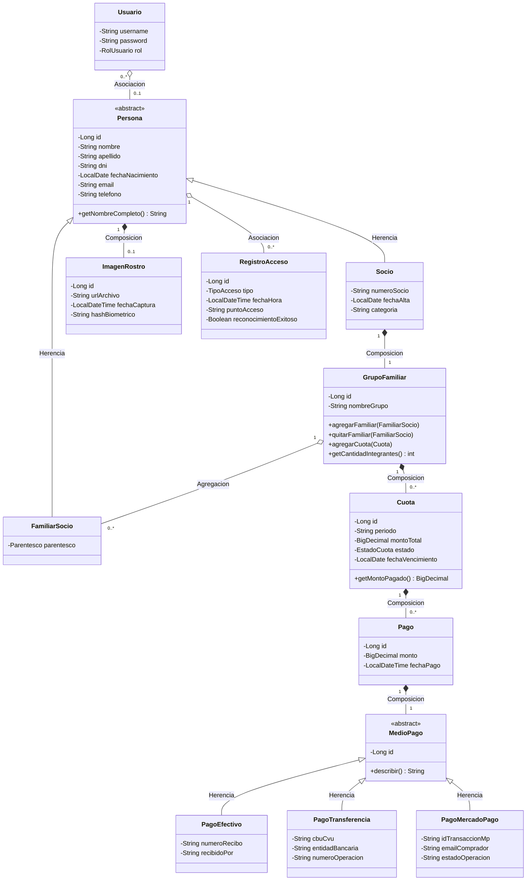

# Punto "a" — Nuevas funcionalidades y diagrama de clases (UML)

## 1. Problema planteado

Sistema de un club deportivo que registra al socio y su grupo familiar.
Al ingresar/egresar del club, el sistema registra el horario de entrada y
de salida. Además de los datos principales, se guarda una imagen del
rostro de cada persona (para el control de acceso).

## 2. Nuevas funcionalidades propuestas

Para poder exhibir en el mismo modelo las **4 relaciones UML pedidas**
(Asociación, Agregación, Composición y Herencia) se proponen las
siguientes funcionalidades nuevas, todas implementadas en el código:

1. **Unificar Socio y Familiar bajo una superclase común `Persona`**
   (nombre, apellido, DNI, foto de rostro, historial de accesos), para
   que el control de acceso y el reconocimiento facial funcionen igual
   para el titular y para cada integrante de su grupo familiar → **Herencia**.

2. **Gestión explícita del Grupo Familiar** como entidad propia
   (`GrupoFamiliar`), en lugar de una simple lista de familiares dentro
   del socio: permite nombrar al grupo, consultarlo, y — sobre todo —
   asociarle sus propias cuotas mensuales.

3. **Cobro de la cuota del club por grupo familiar**, con soporte de
   **pagos parciales** y **3 medios de pago** (Efectivo, Transferencia,
   Mercado Pago), cada uno con sus propios datos particulares
   (número de recibo, CBU, ID de transacción, etc.) → segunda **Herencia**
   del modelo (`MedioPago`).

4. **Baja lógica y reasignación de familiares entre grupos**, que
   justifica que la relación GrupoFamiliar-FamiliarSocio sea de
   **Agregación** (el familiar sobrevive fuera del grupo) y no de
   Composición.

## 3. Relaciones UML del modelo (con su justificación)

| # | Relación | Cardinalidad | Tipo UML | Justificación |
|---|----------|--------------|----------|----------------|
| 1 | `Persona` ⟶ `Socio` / `FamiliarSocio` | — | **Herencia** | Socio y Familiar comparten todos los atributos y el comportamiento de una Persona (nombre, DNI, foto, historial de accesos); sólo difieren en los atributos propios de su rol. |
| 2 | `MedioPago` ⟶ `PagoEfectivo` / `PagoTransferencia` / `PagoMercadoPago` | — | **Herencia** | Un `Pago` debe poder registrarse con cualquiera de los 3 medios sin que el resto del sistema conozca el subtipo concreto (polimorfismo). |
| 3 | `Persona` 1 — 1 `ImagenRostro` | 1 a 1 | **Composición** | La foto de rostro no tiene sentido ni existencia propia fuera de la persona a la que pertenece: se crea y se borra junto con ella. |
| 4 | `Socio` 1 — 1 `GrupoFamiliar` | 1 a 1 | **Composición** | El grupo familiar es creado junto con el alta del socio titular y no puede existir sin él (si se da de baja definitiva al socio, se elimina su grupo). |
| 5 | `GrupoFamiliar` 1 — * `Cuota` | 1 a muchos | **Composición** | Una cuota mensual no tiene sentido de negocio fuera del grupo familiar al que pertenece; si se elimina el grupo, se eliminan sus cuotas. |
| 6 | `Cuota` 1 — * `Pago` | 1 a muchos | **Composición** | Un pago concreto sólo existe en función de la cuota que salda. |
| 7 | `Pago` 1 — 1 `MedioPago` | 1 a 1 | **Composición** | El detalle del medio de pago (n° de recibo, CBU, id de transacción) no existe fuera del pago que lo usa. |
| 8 | `GrupoFamiliar` 1 — * `FamiliarSocio` | 1 a muchos | **Agregación** | Un familiar "pertenece a" un grupo, pero sigue existiendo como `Persona` (con su propio historial de accesos) aunque se lo desvincule o se lo pase a otro grupo: el "todo" no es dueño exclusivo del ciclo de vida de la "parte". |
| 9 | `Persona` 1 — * `RegistroAcceso` | 1 a muchos | **Asociación** | Cada movimiento de entrada/salida referencia a una persona, pero es un hecho histórico independiente: se conserva aunque la persona se dé de baja (no se borra en cascada). |
| 10 | `Usuario` * — 1 `Persona` | muchos a 1 (opcional) | **Asociación** | Un usuario del sistema (login) puede opcionalmente corresponder a una persona del club (ej. un empleado que también es socio); son conceptos independientes (seguridad vs. dominio). |

## 4. Diagrama de clases (notación Mermaid)

## 5. Justificación de las estrategias de mapeo ORM elegidas

- **`Persona` → JOINED** (tabla `persona` + `socio` + `familiar_socio`):
  se prioriza la normalización porque `Socio` y `FamiliarSocio` tienen
  bastantes atributos propios y bien diferenciados.
- **`MedioPago` → SINGLE_TABLE** (una sola tabla `medio_pago` con columna
  discriminadora): se prioriza el rendimiento de lectura (sin JOINs) ya
  que los atributos de cada subtipo son pocos y livianos.
